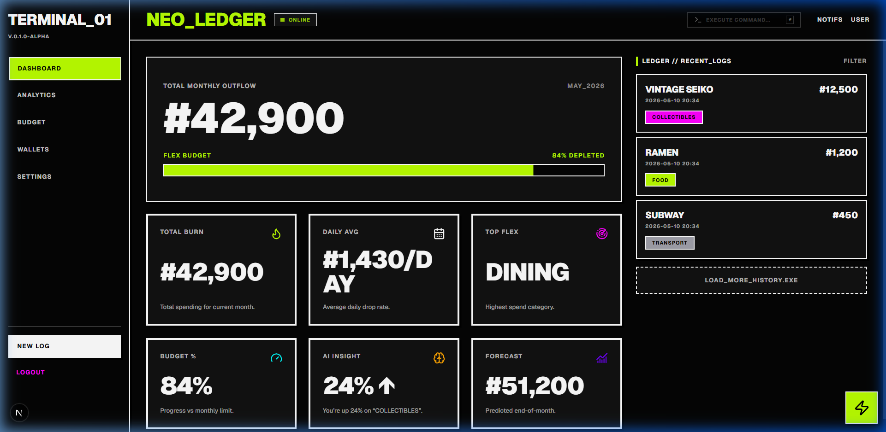
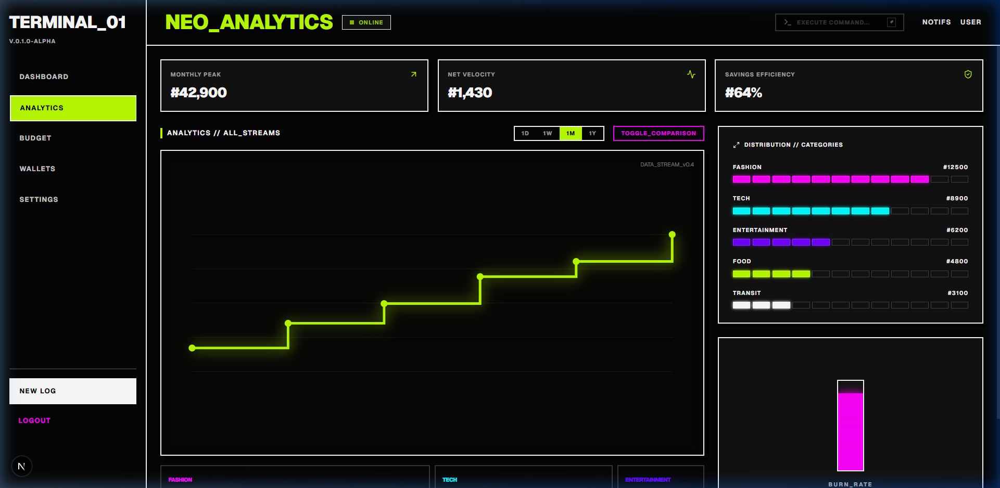
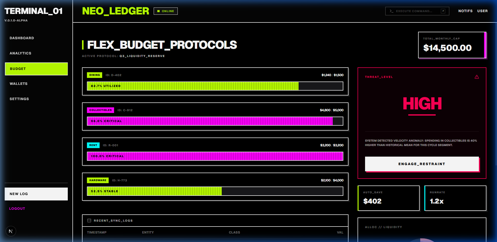
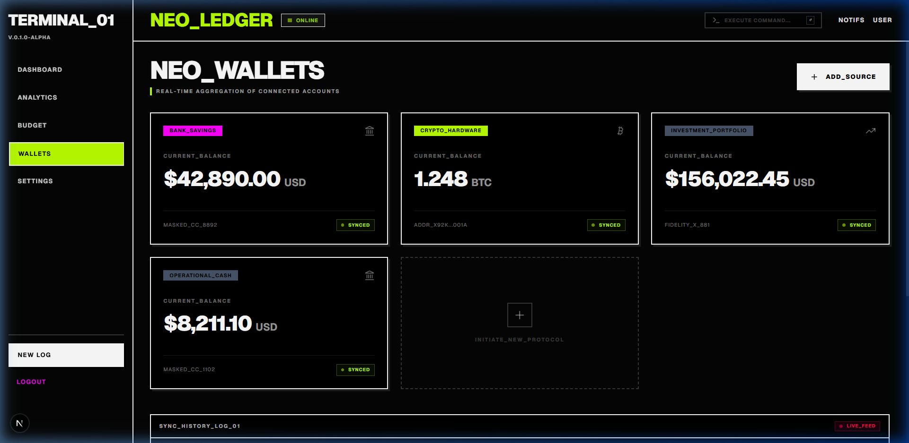
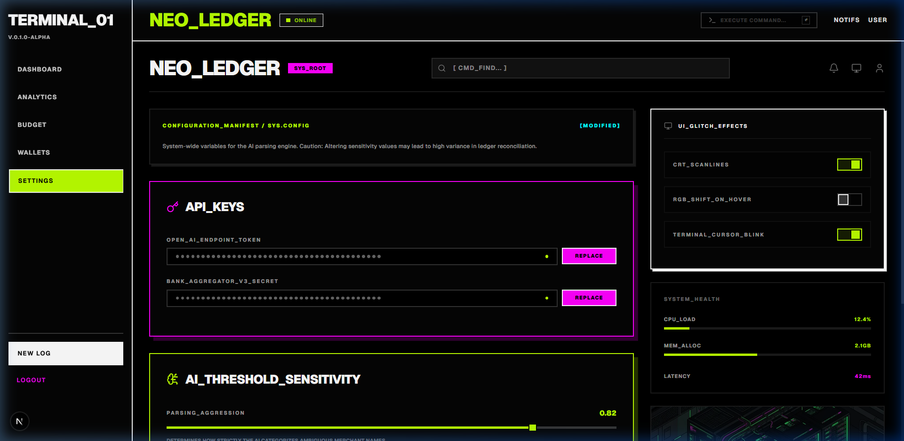

# NEO_LEDGER // AI EXPENSE TRACKER

## What are we making?
**NEO_LEDGER** is a futuristic, high-performance expense tracking application designed with a high-contrast **Neo-Brutalism / Cyber-Pop** aesthetic. It leverages AI to parse natural language inputs into structured financial data, allowing users to track expenses by simply typing commands like `"50 credits for Ramen at Sector 7"`.

## Why are we making it?
Standard banking apps are often "Bank Blue" and sterile. NEO_LEDGER is built for those who want a **developer-centric, terminal-inspired interface** that feels alive. It's not just a tracker; it's a command center for your liquidity.

---

## 🚀 Key Features

### 1. Command Center (AI Parser)
Type your transactions in plain English. The integrated AI engine extracts amounts, categories, and vendors instantly.

### 2. Neo-Analytics
High-density data visualization using stepped line charts and category distribution treemaps.

### 3. Flex Budget Protocols
Segmented progress tracks for your budget categories. Features a reactive **Threat Level** system that alerts you to velocity anomalies.

### 4. Liquid Asset Management (Wallets)
Consolidated view of your bank accounts, crypto hardware, and investment portfolios with real-time sync logs.

### 5. System Configuration
Granular control over AI sensitivity thresholds and UI glitch effects (CRT scanlines, RGB shifts).

---

## 🛠️ Tech Stack
- **Frontend**: Next.js 15, Tailwind CSS 4, Framer Motion
- **UI Components**: Custom shadcn/ui (Strict 0px radius)
- **Icons**: Lucide React
- **Backend**: Python (FastAPI/Pydantic) for AI Parsing

---

## 🔓 Open Source & LLM Configuration
NEO_LEDGER is fully open-source. To maintain privacy and flexibility, **users must configure their own LLM endpoint**.

### Configuring your LLM:
1. Navigate to the **Settings** page.
2. Enter your `OPEN_AI_ENDPOINT_TOKEN` (or compatible provider).
3. Adjust the `PARSING_AGGRESSION` and `FUZZY_MATCH_CONFIDENCE` to suit your needs.

---

## 📈 Future Goals
- **Live Deployment**: Fully usable cloud-hosted version.
- **Enhanced Auth**: Robust multi-factor authentication and role-based access.
- **Android Application**: A native mobile experience using React Native, maintaining the same high-tech aesthetic.

---

## 🤝 Contribution Guide
We welcome contributions from the community! Whether it's adding new "glitch" effects or improving the AI parsing logic.

### How to contribute:
1. **Fork the repo** and create your feature branch.
2. **Follow the Style Guide**: 
    - Use pure black `#000000` backgrounds.
    - Strict `0px` border-radius.
    - 2px white or neon borders.
    - JetBrains Mono for data.
3. **Submit a Pull Request**: Provide clear descriptions and screenshots of your changes.

---

## 🚦 Getting Started (Local Dev)
1. Clone the repository.
2. Navigate to `/frontend` and run `pnpm install`.
3. Run the development server with `pnpm dev`.
4. Navigate to `http://localhost:3000`.

---
*© 2026 NEO_LEDGER_CORP // TERMINAL_01*
